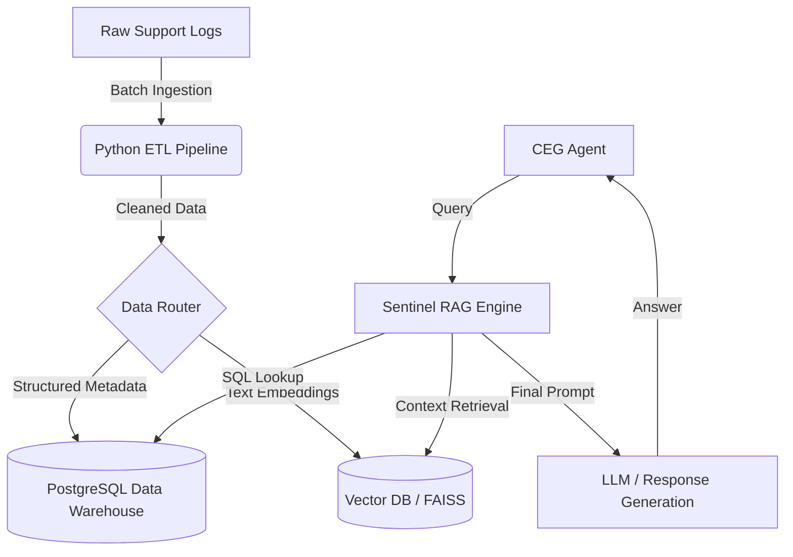

## 🏗 System Architecture

## 🚀 Future Improvements
In a production environment, I would migrate the PostgreSQL database to a distributed cluster and replace the in-memory vector search with **Elasticsearch** or **Milvus** to handle millions of concurrent requests.
